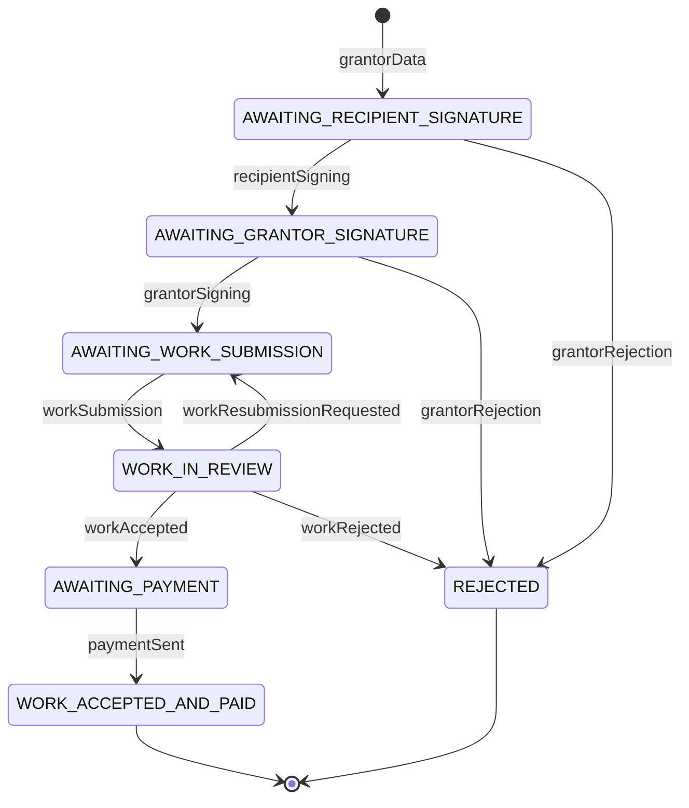

```mermaid
stateDiagram-v2
    [*] --> AWAITING_RECIPIENT_SIGNATURE: grantorData
    
    AWAITING_RECIPIENT_SIGNATURE --> AWAITING_GRANTOR_SIGNATURE: recipientSigning
    AWAITING_RECIPIENT_SIGNATURE --> REJECTED: grantorRejection
    
    AWAITING_GRANTOR_SIGNATURE --> AWAITING_WORK_SUBMISSION: grantorSigning
    AWAITING_GRANTOR_SIGNATURE --> REJECTED: grantorRejection
    
    AWAITING_WORK_SUBMISSION --> WORK_IN_REVIEW: workSubmission
    
    WORK_IN_REVIEW --> AWAITING_WORK_SUBMISSION: workResubmissionRequested
    WORK_IN_REVIEW --> AWAITING_PAYMENT: workAccepted
    WORK_IN_REVIEW --> REJECTED: workRejected
    
    AWAITING_PAYMENT --> WORK_ACCEPTED_AND_PAID: paymentSent
    
    WORK_ACCEPTED_AND_PAID --> [*]
    REJECTED --> [*]
``` 