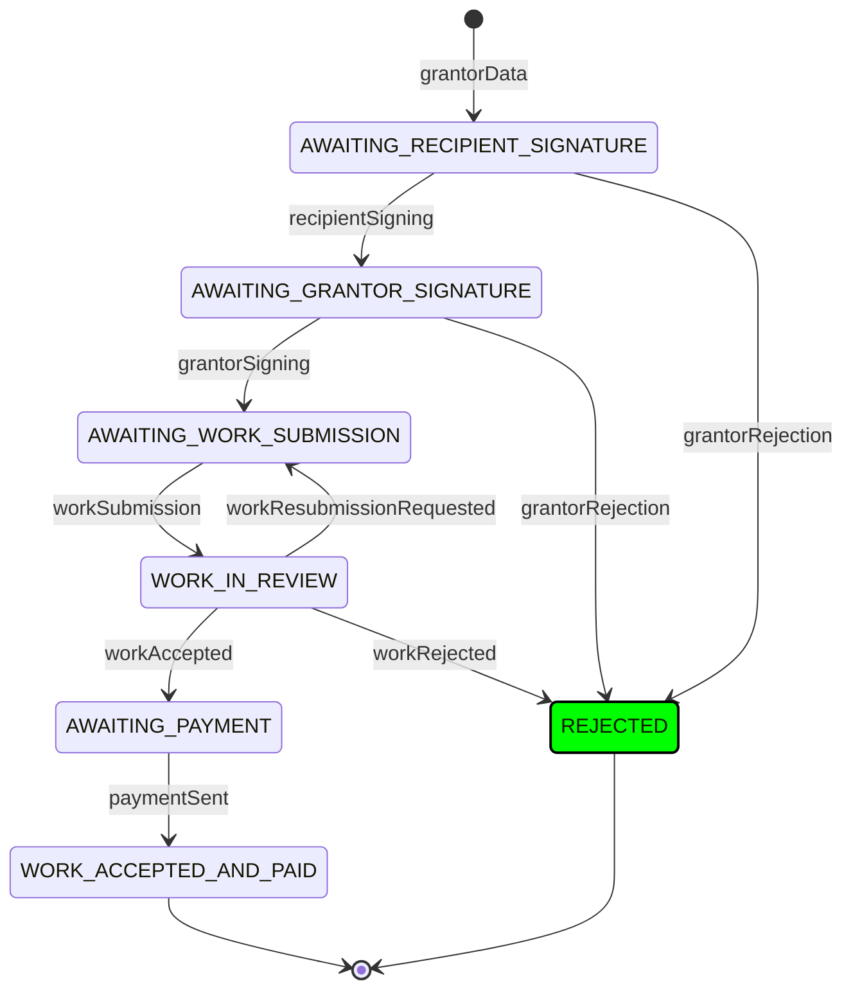

# DFSM Test Paths

## Happy Path - Complete Agreement Flow
```mermaid
stateDiagram-v2
    [*] --> AWAITING_RECIPIENT_SIGNATURE: grantorData
    
    AWAITING_RECIPIENT_SIGNATURE --> AWAITING_GRANTOR_SIGNATURE: recipientSigning
    AWAITING_RECIPIENT_SIGNATURE --> REJECTED: grantorRejection
    
    AWAITING_GRANTOR_SIGNATURE --> AWAITING_WORK_SUBMISSION: grantorSigning
    AWAITING_GRANTOR_SIGNATURE --> REJECTED: grantorRejection
    
    AWAITING_WORK_SUBMISSION --> WORK_IN_REVIEW: workSubmission
    
    WORK_IN_REVIEW --> AWAITING_WORK_SUBMISSION: workResubmissionRequested
    WORK_IN_REVIEW --> AWAITING_PAYMENT: workAccepted
    WORK_IN_REVIEW --> REJECTED: workRejected
    
    AWAITING_PAYMENT --> WORK_ACCEPTED_AND_PAID: paymentSent
    
    WORK_ACCEPTED_AND_PAID --> [*]
    REJECTED --> [*]

    classDef testPath fill:#00ff00,stroke:#000,stroke-width:2px
    class [*],AWAITING_RECIPIENT_SIGNATURE,AWAITING_GRANTOR_SIGNATURE,AWAITING_WORK_SUBMISSION,WORK_IN_REVIEW,AWAITING_PAYMENT,WORK_ACCEPTED_AND_PAID testPath
```

**Description**: Tests the complete happy path from agreement creation through work acceptance and payment. Verifies that all states transition correctly when valid inputs are provided at each step.

## Work Resubmission Path
```mermaid
stateDiagram-v2
    [*] --> AWAITING_RECIPIENT_SIGNATURE: grantorData
    
    AWAITING_RECIPIENT_SIGNATURE --> AWAITING_GRANTOR_SIGNATURE: recipientSigning
    AWAITING_RECIPIENT_SIGNATURE --> REJECTED: grantorRejection
    
    AWAITING_GRANTOR_SIGNATURE --> AWAITING_WORK_SUBMISSION: grantorSigning
    AWAITING_GRANTOR_SIGNATURE --> REJECTED: grantorRejection
    
    AWAITING_WORK_SUBMISSION --> WORK_IN_REVIEW: workSubmission
    
    WORK_IN_REVIEW --> AWAITING_WORK_SUBMISSION: workResubmissionRequested
    WORK_IN_REVIEW --> AWAITING_PAYMENT: workAccepted
    WORK_IN_REVIEW --> REJECTED: workRejected
    
    AWAITING_PAYMENT --> WORK_ACCEPTED_AND_PAID: paymentSent
    
    WORK_ACCEPTED_AND_PAID --> [*]
    REJECTED --> [*]

    classDef testPath fill:#00ff00,stroke:#000,stroke-width:2px
    class [*],AWAITING_RECIPIENT_SIGNATURE,AWAITING_GRANTOR_SIGNATURE,AWAITING_WORK_SUBMISSION,WORK_IN_REVIEW,AWAITING_WORK_SUBMISSION testPath
```

**Description**: Tests the work resubmission flow where the grantor requests changes to the submitted work. Verifies that the state machine correctly transitions back to AWAITING_WORK_SUBMISSION when resubmission is requested.

## Work Rejection Path
```mermaid
stateDiagram-v2
    [*] --> AWAITING_RECIPIENT_SIGNATURE: grantorData
    
    AWAITING_RECIPIENT_SIGNATURE --> AWAITING_GRANTOR_SIGNATURE: recipientSigning
    AWAITING_RECIPIENT_SIGNATURE --> REJECTED: grantorRejection
    
    AWAITING_GRANTOR_SIGNATURE --> AWAITING_WORK_SUBMISSION: grantorSigning
    AWAITING_GRANTOR_SIGNATURE --> REJECTED: grantorRejection
    
    AWAITING_WORK_SUBMISSION --> WORK_IN_REVIEW: workSubmission
    
    WORK_IN_REVIEW --> AWAITING_WORK_SUBMISSION: workResubmissionRequested
    WORK_IN_REVIEW --> AWAITING_PAYMENT: workAccepted
    WORK_IN_REVIEW --> REJECTED: workRejected
    
    AWAITING_PAYMENT --> WORK_ACCEPTED_AND_PAID: paymentSent
    
    WORK_ACCEPTED_AND_PAID --> [*]
    REJECTED --> [*]

    classDef testPath fill:#00ff00,stroke:#000,stroke-width:2px
    class [*],AWAITING_RECIPIENT_SIGNATURE,AWAITING_GRANTOR_SIGNATURE,AWAITING_WORK_SUBMISSION,WORK_IN_REVIEW,REJECTED testPath
```

**Description**: Tests the work rejection flow where the grantor rejects the submitted work. Verifies that the state machine correctly transitions to REJECTED state when work is rejected.

## Agreement Rejection Path
```mermaid
stateDiagram-v2
    [*] --> AWAITING_RECIPIENT_SIGNATURE: grantorData
    
    AWAITING_RECIPIENT_SIGNATURE --> AWAITING_GRANTOR_SIGNATURE: recipientSigning
    AWAITING_RECIPIENT_SIGNATURE --> REJECTED: grantorRejection
    
    AWAITING_GRANTOR_SIGNATURE --> AWAITING_WORK_SUBMISSION: grantorSigning
    AWAITING_GRANTOR_SIGNATURE --> REJECTED: grantorRejection
    
    AWAITING_WORK_SUBMISSION --> WORK_IN_REVIEW: workSubmission
    
    WORK_IN_REVIEW --> AWAITING_WORK_SUBMISSION: workResubmissionRequested
    WORK_IN_REVIEW --> AWAITING_PAYMENT: workAccepted
    WORK_IN_REVIEW --> REJECTED: workRejected
    
    AWAITING_PAYMENT --> WORK_ACCEPTED_AND_PAID: paymentSent
    
    WORK_ACCEPTED_AND_PAID --> [*]
    REJECTED --> [*]

    classDef testPath fill:#00ff00,stroke:#000,stroke-width:2px
    class [*],AWAITING_RECIPIENT_SIGNATURE,AWAITING_GRANTOR_SIGNATURE,REJECTED testPath
```

**Description**: Tests the agreement rejection flow where the grantor rejects the agreement after recipient signing. Verifies that the state machine correctly transitions to REJECTED state when the agreement is rejected.

## Invalid Input Test


**Description**: Tests error handling for invalid input. Verifies that the state machine remains in its current state (REJECTED) and returns an error when an invalid input ID is provided. 