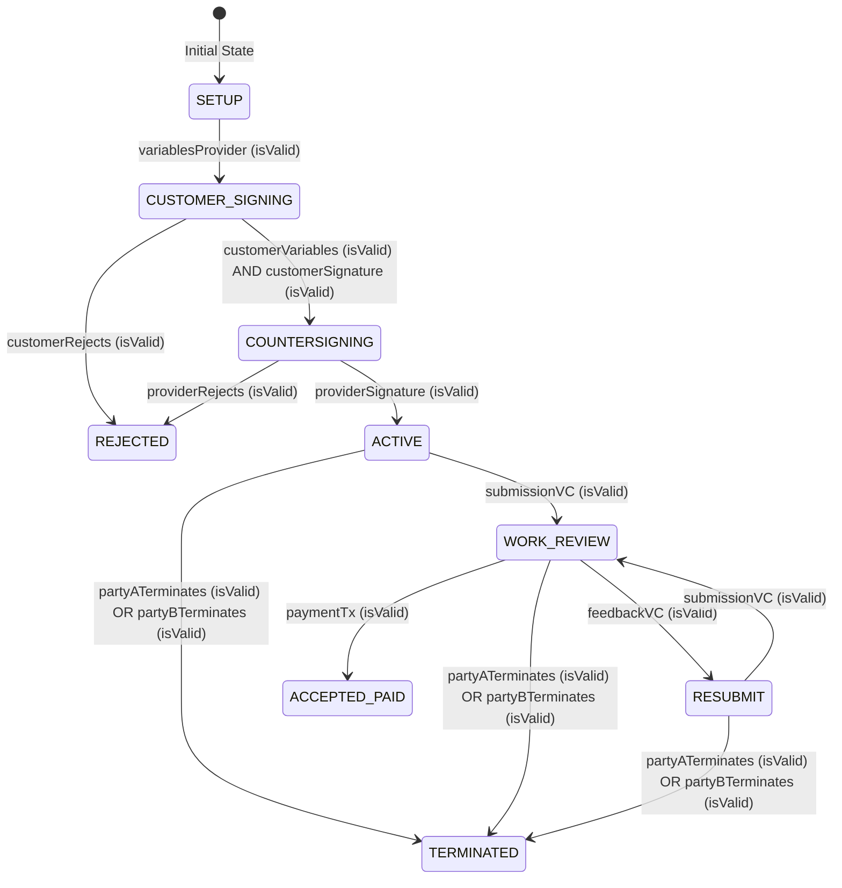

```mermaid
stateDiagram-v2
    [*] --> SETUP: Initial State
    SETUP --> CUSTOMER_SIGNING: variablesProvider (isValid)
    CUSTOMER_SIGNING --> COUNTERSIGNING: customerVariables (isValid) AND customerSignature (isValid)
    CUSTOMER_SIGNING --> REJECTED: customerRejects (isValid)
    COUNTERSIGNING --> ACTIVE: providerSignature (isValid)
    COUNTERSIGNING --> REJECTED: providerRejects (isValid)
    ACTIVE --> WORK_REVIEW: submissionVC (isValid)
    ACTIVE --> TERMINATED: partyATerminates (isValid) OR partyBTerminates (isValid)
    WORK_REVIEW --> RESUBMIT: feedbackVC (isValid)
    WORK_REVIEW --> ACCEPTED_PAID: paymentTx (isValid)
    WORK_REVIEW --> TERMINATED: partyATerminates (isValid) OR partyBTerminates (isValid)
    RESUBMIT --> WORK_REVIEW: submissionVC (isValid)
    RESUBMIT --> TERMINATED: partyATerminates (isValid) OR partyBTerminates (isValid)
```
