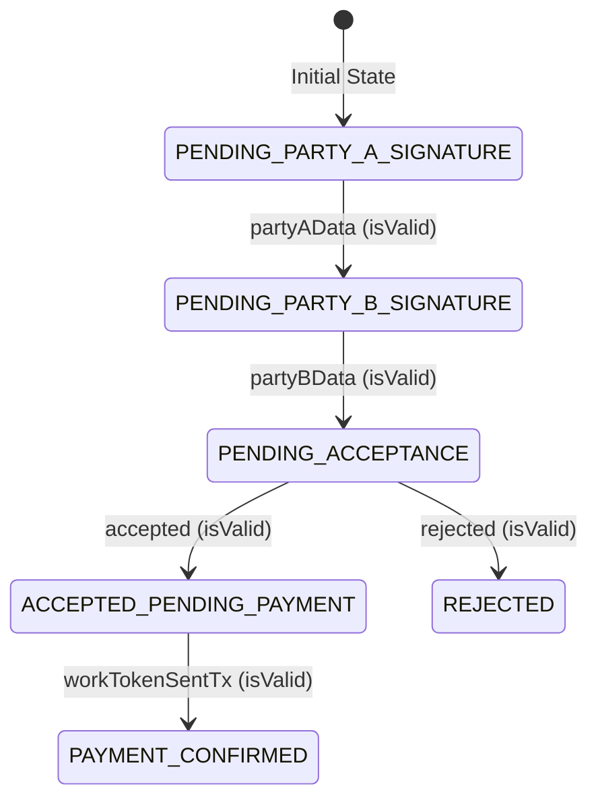

```mermaid
stateDiagram-v2
    [*] --> PENDING_PARTY_A_SIGNATURE: Initial State
    PENDING_PARTY_A_SIGNATURE --> PENDING_PARTY_B_SIGNATURE: partyAData (isValid)
    PENDING_PARTY_B_SIGNATURE --> PENDING_ACCEPTANCE: partyBData (isValid)
    PENDING_ACCEPTANCE --> ACCEPTED_PENDING_PAYMENT: accepted (isValid)
    PENDING_ACCEPTANCE --> REJECTED: rejected (isValid)
    ACCEPTED_PENDING_PAYMENT --> PAYMENT_CONFIRMED: workTokenSentTx (isValid)
```
