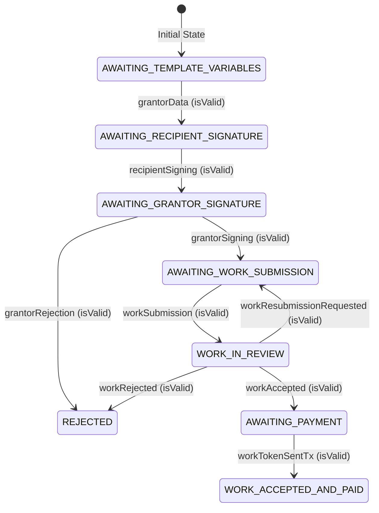

```mermaid
stateDiagram-v2
    [*] --> AWAITING_TEMPLATE_VARIABLES: Initial State
    AWAITING_TEMPLATE_VARIABLES --> AWAITING_RECIPIENT_SIGNATURE: grantorData (isValid)
    AWAITING_RECIPIENT_SIGNATURE --> AWAITING_GRANTOR_SIGNATURE: recipientSigning (isValid)
    AWAITING_GRANTOR_SIGNATURE --> AWAITING_WORK_SUBMISSION: grantorSigning (isValid)
    AWAITING_GRANTOR_SIGNATURE --> REJECTED: grantorRejection (isValid)
    AWAITING_WORK_SUBMISSION --> WORK_IN_REVIEW: workSubmission (isValid)
    
    WORK_IN_REVIEW --> AWAITING_PAYMENT: workAccepted (isValid)
    WORK_IN_REVIEW --> AWAITING_WORK_SUBMISSION: workResubmissionRequested (isValid)
    WORK_IN_REVIEW --> REJECTED: workRejected (isValid)
    
    AWAITING_PAYMENT --> WORK_ACCEPTED_AND_PAID: workTokenSentTx (isValid)
```
