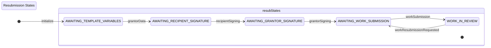
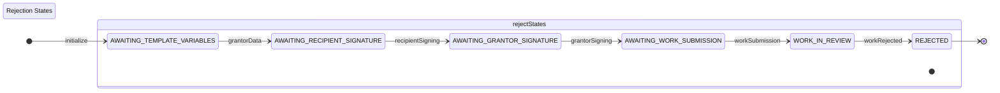
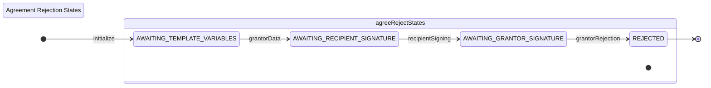
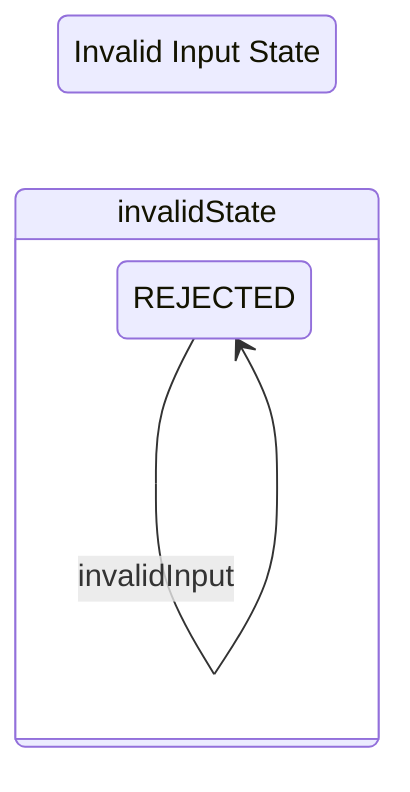

# DFSM Test Paths

## Happy Path - Complete Agreement Flow

```mermaid
stateDiagram-v2
    direction LR
    
    state "Happy Path States" as happyStates #LightGreen
    
    [*] --> AWAITING_TEMPLATE_VARIABLES: initialize
    AWAITING_TEMPLATE_VARIABLES --> AWAITING_RECIPIENT_SIGNATURE: grantorData
    AWAITING_RECIPIENT_SIGNATURE --> AWAITING_GRANTOR_SIGNATURE: recipientSigning
    AWAITING_GRANTOR_SIGNATURE --> AWAITING_WORK_SUBMISSION: grantorSigning
    AWAITING_WORK_SUBMISSION --> WORK_IN_REVIEW: workSubmission
    WORK_IN_REVIEW --> AWAITING_PAYMENT: workAccepted
    AWAITING_PAYMENT --> WORK_ACCEPTED_AND_PAID: workTokenSentTx
    WORK_ACCEPTED_AND_PAID --> [*]
    
    state happyStates {
        [*]
        AWAITING_TEMPLATE_VARIABLES
        AWAITING_RECIPIENT_SIGNATURE
        AWAITING_GRANTOR_SIGNATURE
        AWAITING_WORK_SUBMISSION
        WORK_IN_REVIEW
        AWAITING_PAYMENT
        WORK_ACCEPTED_AND_PAID
    }
```

**Description**: Tests the complete happy path from agreement creation through work acceptance and payment. Verifies that all states transition correctly when valid inputs are provided at each step.

## Work Resubmission Path

**Description**: Tests the work resubmission flow where the grantor requests changes to the submitted work. Verifies that the state machine correctly transitions back to AWAITING_WORK_SUBMISSION when resubmission is requested.

## Work Rejection Path

**Description**: Tests the work rejection flow where the grantor rejects the submitted work. Verifies that the state machine correctly transitions to REJECTED state when work is rejected.

## Agreement Rejection Path

**Description**: Tests the agreement rejection flow where the grantor rejects the agreement after recipient signing. Verifies that the state machine correctly transitions to REJECTED state when the agreement is rejected.

## Invalid Input Test

**Description**: Tests error handling for invalid input. Verifies that the state machine remains in its current state (REJECTED) and returns an error when an invalid input ID is provided. 