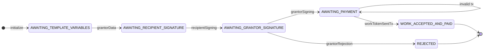

# Simple Grant Agreement State Machine

```mermaid
stateDiagram-v2
    direction LR
    
    [*] --> AWAITING_TEMPLATE_VARIABLES: initialize
    
    AWAITING_TEMPLATE_VARIABLES --> AWAITING_RECIPIENT_SIGNATURE: grantorData
    AWAITING_RECIPIENT_SIGNATURE --> AWAITING_GRANTOR_SIGNATURE: recipientSigning
    
    AWAITING_GRANTOR_SIGNATURE --> AWAITING_PAYMENT: grantorSigning
    AWAITING_GRANTOR_SIGNATURE --> REJECTED: grantorRejection
    
    AWAITING_PAYMENT --> AWAITING_PAYMENT: invalid tx
    AWAITING_PAYMENT --> WORK_ACCEPTED_AND_PAID: workTokenSentTx
    
    WORK_ACCEPTED_AND_PAID --> [*]
    REJECTED --> [*]
``` 