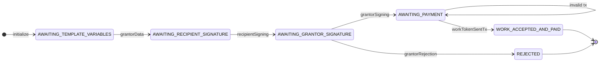
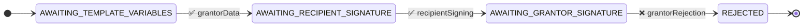

# Simple Grant Agreement State Machine

## Test Scenarios

### 1. Happy Path
This test verifies the successful completion of a grant agreement where all parties agree and payment is successful.

```mermaid
stateDiagram-v2
    direction LR
    [*] --> AWAITING_TEMPLATE_VARIABLES
    AWAITING_TEMPLATE_VARIABLES --> AWAITING_RECIPIENT_SIGNATURE: ✅ grantorData
    AWAITING_RECIPIENT_SIGNATURE --> AWAITING_GRANTOR_SIGNATURE: ✅ recipientSigning
    AWAITING_GRANTOR_SIGNATURE --> AWAITING_PAYMENT: ✅ grantorSigning
    AWAITING_PAYMENT --> WORK_ACCEPTED_AND_PAID: ✅ workTokenSentTx
    WORK_ACCEPTED_AND_PAID --> [*]
```

Test Steps:
1. Grantor submits initial data
2. Recipient signs the agreement
3. Grantor approves and signs
4. Valid payment transaction is submitted

### 2. Rejection Path
This test verifies that the grantor can reject the agreement after the recipient has signed.

Test Steps:
1. Grantor submits initial data
2. Recipient signs the agreement
3. Grantor rejects the agreement

### 3. Invalid Payment Path
This test verifies that invalid payment transactions are properly handled and the state remains unchanged.

```mermaid
stateDiagram-v2
    direction LR
    [*] --> AWAITING_TEMPLATE_VARIABLES
    AWAITING_TEMPLATE_VARIABLES --> AWAITING_RECIPIENT_SIGNATURE: ✅ grantorData
    AWAITING_RECIPIENT_SIGNATURE --> AWAITING_GRANTOR_SIGNATURE: ✅ recipientSigning
    AWAITING_GRANTOR_SIGNATURE --> AWAITING_PAYMENT: ✅ grantorSigning
    AWAITING_PAYMENT --> AWAITING_PAYMENT: ❌ invalid tx
```

Test Steps:
1. Grantor submits initial data
2. Recipient signs the agreement
3. Grantor approves and signs
4. Invalid payment transaction is submitted
5. State remains in AWAITING_PAYMENT

Note: The test suite runs these scenarios twice:
- Once with "unwrapped" inputs (raw JSON)
- Once with "wrapped" inputs (VerifiedCredential format) 