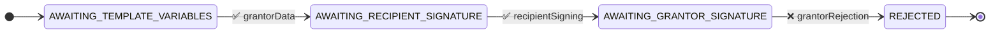

# Grant Agreement with Feedback State Machine

This state machine implements a grant agreement that supports iterative work submission and feedback, allowing the recipient to improve their work based on grantor feedback before final acceptance.

## State Machine Overview

```mermaid
stateDiagram-v2
    direction LR
    
    [*] --> AWAITING_TEMPLATE_VARIABLES: initialize
    
    AWAITING_TEMPLATE_VARIABLES --> AWAITING_RECIPIENT_SIGNATURE: grantorData
    AWAITING_RECIPIENT_SIGNATURE --> AWAITING_GRANTOR_SIGNATURE: recipientSigning
    
    AWAITING_GRANTOR_SIGNATURE --> AWAITING_WORK_SUBMISSION: grantorSigning
    AWAITING_GRANTOR_SIGNATURE --> REJECTED: grantorRejection
    
    AWAITING_WORK_SUBMISSION --> WORK_IN_REVIEW: workSubmission
    
    WORK_IN_REVIEW --> AWAITING_PAYMENT: workAccepted
    WORK_IN_REVIEW --> AWAITING_WORK_SUBMISSION: workRejected
    
    AWAITING_PAYMENT --> WORK_ACCEPTED_AND_PAID: workTokenSentTx
    
    WORK_ACCEPTED_AND_PAID --> [*]
    REJECTED --> [*]
```

## Key Features

1. **Iterative Work Submission**: The state machine allows work to be submitted multiple times, with each submission incorporating feedback from the grantor.
2. **Feedback Loop**: When work is rejected, the state returns to AWAITING_WORK_SUBMISSION instead of terminating, enabling improvements.
3. **Final Acceptance**: Only when the grantor is satisfied with the work does the state progress to payment.

## Test Scenarios

### 1. Iterative Work Submission (Main Flow)
This test demonstrates the core feature: work submission, rejection with feedback, resubmission, and final acceptance.

```mermaid
stateDiagram-v2
    direction LR
    [*] --> AWAITING_TEMPLATE_VARIABLES
    AWAITING_TEMPLATE_VARIABLES --> AWAITING_RECIPIENT_SIGNATURE: ✅ grantorData
    AWAITING_RECIPIENT_SIGNATURE --> AWAITING_GRANTOR_SIGNATURE: ✅ recipientSigning
    AWAITING_GRANTOR_SIGNATURE --> AWAITING_WORK_SUBMISSION: ✅ grantorSigning
    AWAITING_WORK_SUBMISSION --> WORK_IN_REVIEW: ✅ Initial Submission
    WORK_IN_REVIEW --> AWAITING_WORK_SUBMISSION: ❌ Rejection & Feedback
    AWAITING_WORK_SUBMISSION --> WORK_IN_REVIEW: ✅ Improved Submission
    WORK_IN_REVIEW --> AWAITING_PAYMENT: ✅ workAccepted
    AWAITING_PAYMENT --> WORK_ACCEPTED_AND_PAID: ✅ workTokenSentTx
    WORK_ACCEPTED_AND_PAID --> [*]
```

Test Steps:
1. Agreement Setup:
   - Grantor submits initial data
   - Recipient signs the agreement
   - Grantor approves and signs
2. First Work Cycle:
   - Recipient submits initial work
   - Grantor reviews and provides feedback
   - Work is rejected with improvement suggestions
3. Second Work Cycle:
   - Recipient submits improved work
   - Grantor reviews and accepts
4. Payment:
   - Grantor sends payment
   - Agreement completes successfully

### 2. Agreement Rejection Path
This test verifies that the grantor can reject the agreement before work begins.

Test Steps:
1. Grantor submits initial data
2. Recipient signs the agreement
3. Grantor rejects the agreement

### 3. Direct Acceptance Path
This test verifies that work can be accepted on the first submission without requiring revisions.

```mermaid
stateDiagram-v2
    direction LR
    [*] --> AWAITING_TEMPLATE_VARIABLES
    AWAITING_TEMPLATE_VARIABLES --> AWAITING_RECIPIENT_SIGNATURE: ✅ grantorData
    AWAITING_RECIPIENT_SIGNATURE --> AWAITING_GRANTOR_SIGNATURE: ✅ recipientSigning
    AWAITING_GRANTOR_SIGNATURE --> AWAITING_WORK_SUBMISSION: ✅ grantorSigning
    AWAITING_WORK_SUBMISSION --> WORK_IN_REVIEW: ✅ workSubmission
    WORK_IN_REVIEW --> AWAITING_PAYMENT: ✅ workAccepted
    AWAITING_PAYMENT --> WORK_ACCEPTED_AND_PAID: ✅ workTokenSentTx
    WORK_ACCEPTED_AND_PAID --> [*]
```

Test Steps:
1. Agreement Setup:
   - Grantor submits initial data
   - Recipient signs the agreement
   - Grantor approves and signs
2. Single Work Cycle:
   - Recipient submits work
   - Grantor accepts immediately
3. Payment:
   - Grantor sends payment
   - Agreement completes successfully

### 4. Invalid Input Test
This test verifies that invalid inputs are properly handled and rejected.

```mermaid
stateDiagram-v2
    direction LR
    [*] --> AWAITING_TEMPLATE_VARIABLES
    AWAITING_TEMPLATE_VARIABLES --> AWAITING_RECIPIENT_SIGNATURE: ✅ grantorData
    AWAITING_RECIPIENT_SIGNATURE --> AWAITING_GRANTOR_SIGNATURE: ✅ recipientSigning
    AWAITING_GRANTOR_SIGNATURE --> AWAITING_WORK_SUBMISSION: ✅ grantorSigning
    AWAITING_WORK_SUBMISSION --> WORK_IN_REVIEW: ✅ workSubmission
    WORK_IN_REVIEW --> WORK_IN_REVIEW: ❌ invalidInput
```

Test Steps:
1. Follow normal flow until WORK_IN_REVIEW state
2. Submit invalid input
3. Verify state remains unchanged and error is returned

## Implementation Notes

- The state machine supports both unwrapped (raw JSON) and wrapped (VerifiedCredential) input formats
- Each work submission must include:
  - `submissionHash`: Hash of the work submission content
  - `submissionUrl`: URL to access the submitted work
- Work rejection includes mandatory feedback to guide improvements
- The final state (WORK_ACCEPTED_AND_PAID) requires valid payment proof via transaction hash
