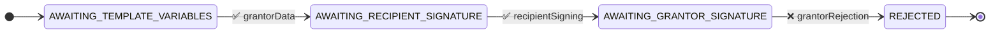

```mermaid
stateDiagram-v2
    direction LR
    [*] --> AWAITING_TEMPLATE_VARIABLES
    AWAITING_TEMPLATE_VARIABLES --> AWAITING_RECIPIENT_SIGNATURE: ✅ grantorData
    AWAITING_RECIPIENT_SIGNATURE --> AWAITING_GRANTOR_SIGNATURE: ✅ recipientSigning
    AWAITING_GRANTOR_SIGNATURE --> AWAITING_WORK_SUBMISSION: ✅ grantorSigning
    AWAITING_WORK_SUBMISSION --> WORK_IN_REVIEW: ✅ workSubmission
    WORK_IN_REVIEW --> AWAITING_PAYMENT: ✅ workAccepted
    AWAITING_PAYMENT --> WORK_ACCEPTED_AND_PAID: ✅ workTokenSentTx
    WORK_ACCEPTED_AND_PAID --> [*]
```

# Grant Agreement with Feedback State Machine

```mermaid
stateDiagram-v2
    direction LR
    
    [*] --> AWAITING_TEMPLATE_VARIABLES: initialize
    
    AWAITING_TEMPLATE_VARIABLES --> AWAITING_RECIPIENT_SIGNATURE: grantorData
    AWAITING_RECIPIENT_SIGNATURE --> AWAITING_GRANTOR_SIGNATURE: recipientSigning
    
    AWAITING_GRANTOR_SIGNATURE --> AWAITING_WORK_SUBMISSION: grantorSigning
    AWAITING_GRANTOR_SIGNATURE --> REJECTED: grantorRejection
    
    AWAITING_WORK_SUBMISSION --> WORK_IN_REVIEW: workSubmission
    
    WORK_IN_REVIEW --> AWAITING_PAYMENT: workAccepted
    WORK_IN_REVIEW --> REJECTED: workRejected
    
    AWAITING_PAYMENT --> WORK_ACCEPTED_AND_PAID: workTokenSentTx
    
    WORK_ACCEPTED_AND_PAID --> [*]
    REJECTED --> [*]
```

## Test Scenarios

### 1. Happy Path
This test verifies the successful completion of a grant agreement where work is submitted, accepted, and payment is made.

Test Steps:
1. Grantor submits initial data
2. Recipient signs the agreement
3. Grantor approves and signs
4. Recipient submits work
5. Grantor accepts the work
6. Valid payment transaction is submitted

### 2. Agreement Rejection Path
This test verifies that the grantor can reject the agreement after the recipient has signed.

Test Steps:
1. Grantor submits initial data
2. Recipient signs the agreement
3. Grantor rejects the agreement

### 3. Work Rejection Path
This test verifies that the grantor can reject the submitted work, ending the agreement.

```mermaid
stateDiagram-v2
    direction LR
    [*] --> AWAITING_TEMPLATE_VARIABLES
    AWAITING_TEMPLATE_VARIABLES --> AWAITING_RECIPIENT_SIGNATURE: ✅ grantorData
    AWAITING_RECIPIENT_SIGNATURE --> AWAITING_GRANTOR_SIGNATURE: ✅ recipientSigning
    AWAITING_GRANTOR_SIGNATURE --> AWAITING_WORK_SUBMISSION: ✅ grantorSigning
    AWAITING_WORK_SUBMISSION --> WORK_IN_REVIEW: ✅ workSubmission
    WORK_IN_REVIEW --> REJECTED: ❌ workRejected
    REJECTED --> [*]
```

Test Steps:
1. Grantor submits initial data
2. Recipient signs the agreement
3. Grantor approves and signs
4. Recipient submits work
5. Grantor rejects the work

### 4. Invalid Input Test
This test verifies that invalid inputs are properly handled and rejected.

```mermaid
stateDiagram-v2
    direction LR
    [*] --> AWAITING_TEMPLATE_VARIABLES
    AWAITING_TEMPLATE_VARIABLES --> AWAITING_RECIPIENT_SIGNATURE: ✅ grantorData
    AWAITING_RECIPIENT_SIGNATURE --> AWAITING_GRANTOR_SIGNATURE: ✅ recipientSigning
    AWAITING_GRANTOR_SIGNATURE --> AWAITING_WORK_SUBMISSION: ✅ grantorSigning
    AWAITING_WORK_SUBMISSION --> WORK_IN_REVIEW: ✅ workSubmission
    WORK_IN_REVIEW --> WORK_IN_REVIEW: ❌ invalidInput
```

Test Steps:
1. Follow normal flow until WORK_IN_REVIEW state
2. Submit invalid input
3. Verify state remains unchanged and error is returned

Note: The test suite runs these scenarios twice:
- Once with "unwrapped" inputs (raw JSON)
- Once with "wrapped" inputs (VerifiedCredential format)
