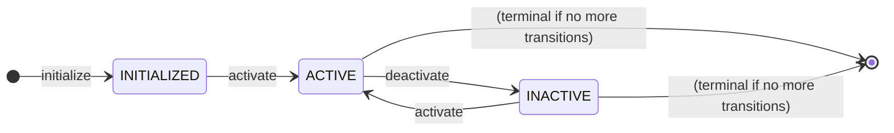
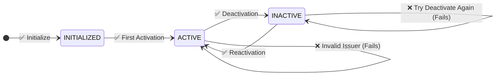
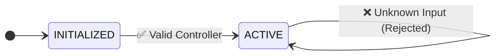

# Manifesto State Machine

This state machine implements a simple manifesto agreement that supports controller-based activation and deactivation. The manifesto allows a designated controller to enable or disable signature collection dynamically.

## State Machine Overview



## Key Features

1. **Controller-Based Access**: Only the designated controller can activate or deactivate the manifesto
2. **Dynamic State Management**: The manifesto can be toggled between active and inactive states multiple times
3. **Issuer Validation**: All inputs are validated against the expected controller's address using DID format
4. **Simple Workflow**: Unlike complex agreement flows, this focuses on basic on/off functionality

## Test Scenarios

### 1. Complete Activation/Deactivation Cycle (Main Flow)
This test demonstrates the core functionality: initialization, activation, deactivation, and reactivation.



Test Steps:
1. **Initialization Check**:
   - Verify the manifesto starts in `INITIALIZED` state
2. **First Activation**:
   - Controller activates the manifesto (`INITIALIZED → ACTIVE`)
3. **Deactivation**:
   - Controller deactivates the manifesto (`ACTIVE → INACTIVE`)
4. **Invalid Deactivation**:
   - Attempt to deactivate when already inactive (should fail)
   - State remains `INACTIVE`
5. **Reactivation**:
   - Controller reactivates the manifesto (`INACTIVE → ACTIVE`)
6. **Input Validation Tests**:
   - Test invalid input ID (should fail)
   - Test invalid issuer/controller (should fail with "Issuer mismatch")

### 2. Security Validation Tests
These tests verify that only the designated controller can perform state transitions.



Test Cases:
1. **Valid Controller Operations**:
   - Controller address: `0x5B38Da6a701c568545dCfcB03FcB875f56beddC4`
   - All `activate`/`deactivate` inputs succeed when from valid controller
2. **Invalid Controller Rejection**:
   - Attempt from address: `0x1234567890123456789012345678901234567890`
   - Should fail with "Issuer mismatch" error
3. **Unknown Input Rejection**:
   - Invalid input IDs should be rejected
   - Should fail with "Unknown input" error

### 3. State Transition Rules
This documents the allowed and forbidden transitions in the state machine.

**Allowed Transitions:**
- `INITIALIZED → ACTIVE` (via `activate` input)
- `ACTIVE → INACTIVE` (via `deactivate` input)
- `INACTIVE → ACTIVE` (via `activate` input)

**Forbidden Transitions:**
- `INITIALIZED → INACTIVE` (must activate first)
- `ACTIVE → ACTIVE` (via `activate` - no state change but succeeds)
- `INACTIVE → INACTIVE` (via `deactivate` - fails with "No valid transition")

## Input Specifications

### Controller Variable
```json
{
  "controller": {
    "type": "address",
    "name": "Manifesto Controller",
    "description": "Ethereum address of the manifesto controller",
    "validation": {
      "required": true
    }
  }
}
```

### Activate Input
```json
{
  "activate": {
    "type": "VerifiedCredentialEIP712",
    "schema": "verified-credential-eip712.schema.json",
    "displayName": "Reactivate",
    "description": "Reactivate the manifesto",
    "data": {
      "activation": "ACTIVATE"
    },
    "issuer": "${variables.controller.value}"
  }
}
```

### Deactivate Input
```json
{
  "deactivate": {
    "type": "VerifiedCredentialEIP712",
    "schema": "verified-credential-eip712.schema.json",
    "displayName": "Deactivate",
    "description": "Deactivate the manifesto",
    "data": {
      "activation": "DEACTIVATE"
    },
    "issuer": "${variables.controller.value}"
  }
}
```

## Test Input Format

### Unwrapped Test Format
For unwrapped tests (`validateVC = false`), inputs must use DID format for proper issuer validation:

```json
{
  "type": "VerifiedCredentialEIP712",
  "issuer": {
    "id": "did:pkh:eip155:1:0x5B38Da6a701c568545dCfcB03FcB875f56beddC4"
  },
  "credentialSubject": {
    "inputId": "activate",
    "type": "signedFields",
    "documentHash": "<agreement_hash>",
    "values": {
      "activation": "ACTIVATE"
    }
  }
}
```

**Important**: The issuer must be in DID format (`did:pkh:eip155:1:<address>`) for the DFSM to extract the Ethereum address for validation in unwrapped mode.

## Implementation Notes

- **Issuer Validation**: The system validates that inputs come from the designated controller by comparing the issuer address extracted from the DID format with the resolved `${variables.controller.value}`
- **Variable Resolution**: The controller address is resolved from the initialization parameters and stored as a variable
- **State Persistence**: Each state transition is recorded with metadata including issuer and timestamp
- **Error Handling**: Clear error messages are provided for invalid issuers, unknown inputs, and invalid transitions
- **Security**: Only the controller can perform state transitions, ensuring access control

## Differences from Other State Machines

Unlike complex workflows (like grant-with-feedback), the manifesto state machine is designed for:
- **Simplicity**: Only three states with basic transitions
- **Administrative Control**: Focus on controller-based management rather than multi-party workflows
- **Reusability**: Can be activated/deactivated multiple times unlike one-way agreement flows
- **Access Control**: Strong emphasis on issuer validation and controller verification 