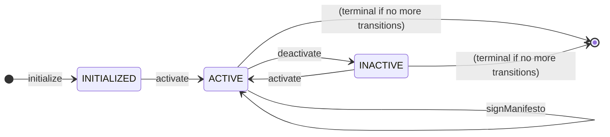
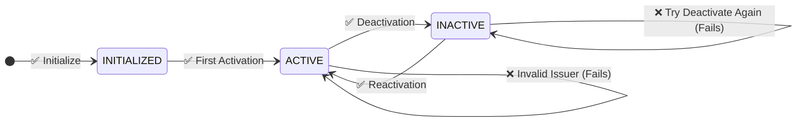
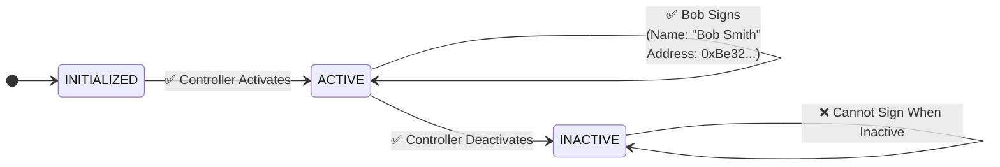
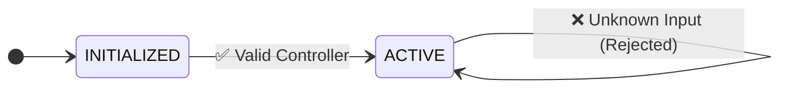

# Manifesto State Machine

This state machine implements a simple manifesto agreement that supports controller-based activation and deactivation. The manifesto allows a designated controller to enable or disable signature collection dynamically.

## State Machine Overview



## Key Features

1. **Controller-Based Access**: Only the designated controller can activate or deactivate the manifesto
2. **Dynamic State Management**: The manifesto can be toggled between active and inactive states multiple times
3. **Open Signature Collection**: When active, anyone can sign the manifesto without issuer validation
4. **Controlled Activation**: Signatures can only be collected when the manifesto is in ACTIVE state
5. **Simple Workflow**: Unlike complex agreement flows, this focuses on basic on/off functionality with signature collection

## Test Scenarios

### 1. Complete Manifesto Lifecycle (Main Happy Path)
This test demonstrates the core functionality: initialization, activation, signature collection, and state management.



Test Steps:
1. **Initialization Check**:
   - Verify the manifesto starts in `INITIALIZED` state
2. **First Activation**:
   - Controller activates the manifesto (`INITIALIZED → ACTIVE`)
3. **Deactivation**:
   - Controller deactivates the manifesto (`ACTIVE → INACTIVE`)
4. **Invalid Deactivation**:
   - Attempt to deactivate when already inactive (should fail)
   - State remains `INACTIVE`
5. **Reactivation**:
   - Controller reactivates the manifesto (`INACTIVE → ACTIVE`)
6. **Signature Collection** (Main Happy Path):
   - Alice signs the manifesto (`ACTIVE → ACTIVE`)
   - Bob signs the manifesto (`ACTIVE → ACTIVE`)
   - Multiple signatures can be collected while manifesto remains active
7. **Input Validation Tests**:
   - Test invalid input ID (should fail)
   - Test invalid issuer/controller (should fail with "Issuer mismatch")

### 2. Signature Collection Flow
This demonstrates the main use case: collecting signatures from multiple parties when the manifesto is active.



**Key Points:**
- **Open Signing**: Anyone can sign when manifesto is `ACTIVE`
- **No Issuer Validation**: Signatures don't require specific issuer validation
- **State Persistence**: Manifesto remains `ACTIVE` to continue collecting signatures
- **Controller Control**: Only controller can start/stop signature collection

### 3. Security Validation Tests
These tests verify that only the designated controller can perform state transitions.



Test Cases:
1. **Valid Controller Operations**:
   - Controller address: `0x5B38Da6a701c568545dCfcB03FcB875f56beddC4`
   - All `activate`/`deactivate` inputs succeed when from valid controller
2. **Invalid Controller Rejection**:
   - Attempt from address: `0x1234567890123456789012345678901234567890`
   - Should fail with "Issuer mismatch" error
3. **Unknown Input Rejection**:
   - Invalid input IDs should be rejected
   - Should fail with "Unknown input" error

### 4. State Transition Rules
This documents the allowed and forbidden transitions in the state machine.

**Allowed Transitions:**
- `INITIALIZED → ACTIVE` (via `activate` input)
- `ACTIVE → INACTIVE` (via `deactivate` input)
- `INACTIVE → ACTIVE` (via `activate` input)
- `ACTIVE → ACTIVE` (via `signManifesto` input)

**Forbidden Transitions:**
- `INITIALIZED → INACTIVE` (must activate first)
- `INACTIVE → INACTIVE` (via `deactivate` - fails with "No valid transition")
- `INACTIVE → ACTIVE` (via `signManifesto` - signatures only accepted when active)

## Input Specifications

### Variables

#### Controller Variable
```json
{
  "controller": {
    "type": "address",
    "name": "Manifesto Controller",
    "description": "Ethereum address of the manifesto controller",
    "validation": {
      "required": true
    }
  }
}
```

#### Signature Variables
```json
{
  "signerName": {
    "type": "string",
    "name": "Signer Name",
    "description": "Name of the person signing the manifesto",
    "validation": {
      "required": true,
      "minLength": 1
    }
  },
  "signerAddress": {
    "type": "address",
    "name": "Signer Address", 
    "description": "Ethereum address of the signer",
    "validation": {
      "required": true
    }
  },
  "signature": {
    "type": "string",
    "name": "Digital Signature",
    "description": "Digital signature of the manifesto",
    "validation": {
      "required": true
    }
  }
}
```

#### Activate Input
```json
{
  "activate": {
    "type": "VerifiedCredentialEIP712",
    "schema": "verified-credential-eip712.schema.json",
    "displayName": "Reactivate",
    "description": "Reactivate the manifesto",
    "data": {
      "activation": "ACTIVATE"
    },
    "issuer": "${variables.controller.value}"
  }
}
```

#### Deactivate Input
```json
{
  "deactivate": {
    "type": "VerifiedCredentialEIP712",
    "schema": "verified-credential-eip712.schema.json",
    "displayName": "Deactivate",
    "description": "Deactivate the manifesto",
    "data": {
      "activation": "DEACTIVATE"
    },
    "issuer": "${variables.controller.value}"
  }
}
```

#### Sign Manifesto Input
```json
{
  "signManifesto": {
    "type": "VerifiedCredentialEIP712",
    "schema": "verified-credential-eip712.schema.json",
    "displayName": "Sign Manifesto",
    "description": "Sign the manifesto agreement",
    "data": {
      "signerName": "${variables.signerName}",
      "signerAddress": "${variables.signerAddress}",
      "signature": "${variables.signature}"
    }
  }
}
```

**Key Features:**
- **No Issuer Validation**: Unlike controller inputs, signatures don't specify an `issuer` field
- **Open Access**: Anyone can submit a signature when the manifesto is `ACTIVE`
- **Rich Data**: Captures signer name, address, and signature content
- **State Preservation**: Transitions from `ACTIVE → ACTIVE` to continue collecting signatures

## Test Input Format

### Unwrapped Test Format

#### Controller Inputs (with Issuer Validation)
For controller inputs (`activate`/`deactivate`), inputs must use DID format for proper issuer validation:

```json
{
  "type": "VerifiedCredentialEIP712",
  "issuer": {
    "id": "did:pkh:eip155:1:0x5B38Da6a701c568545dCfcB03FcB875f56beddC4"
  },
  "credentialSubject": {
    "inputId": "activate",
    "type": "signedFields",
    "documentHash": "<agreement_hash>",
    "values": {
      "activation": "ACTIVATE"
    }
  }
}
```

#### Signature Inputs (no Issuer Validation)
For signature collection, the format is simpler since no issuer validation is required:

```json
{
  "inputId": "signManifesto",
  "type": "signedFields",
  "values": {
    "signerName": "Alice Johnson",
    "signerAddress": "0x4B20993Bc481177ec7E8f571ceCaE8A9e22C02db",
    "signature": "Alice's digital signature of the manifesto agreement"
  }
}
```

**Important**: 
- Controller inputs require DID format (`did:pkh:eip155:1:<address>`) for issuer validation
- Signature inputs use simplified format without issuer field for open access

## Implementation Notes

- **Issuer Validation**: The system validates that inputs come from the designated controller by comparing the issuer address extracted from the DID format with the resolved `${variables.controller.value}`
- **Variable Resolution**: The controller address is resolved from the initialization parameters and stored as a variable
- **State Persistence**: Each state transition is recorded with metadata including issuer and timestamp
- **Error Handling**: Clear error messages are provided for invalid issuers, unknown inputs, and invalid transitions
- **Security**: Only the controller can perform state transitions, ensuring access control

## Differences from Other State Machines

Unlike complex workflows (like grant-with-feedback), the manifesto state machine is designed for:
- **Simplicity**: Only three states with basic transitions
- **Dual Access Model**: Controller-based management for activation/deactivation + open signature collection
- **Signature Collection**: Primary use case is gathering signatures from multiple parties when active
- **Reusability**: Can be activated/deactivated multiple times unlike one-way agreement flows
- **Mixed Validation**: Strong issuer validation for controller actions, no validation for signatures
- **State Persistence**: Remains in ACTIVE state while collecting multiple signatures 