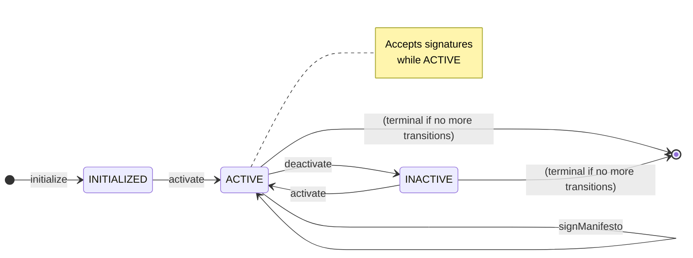
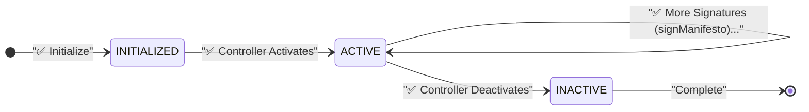
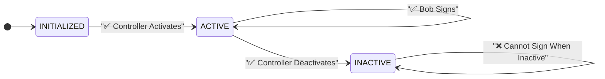
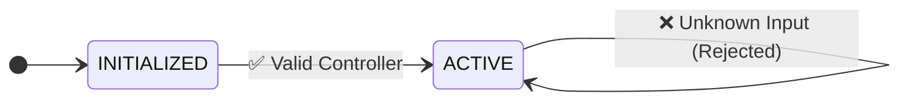
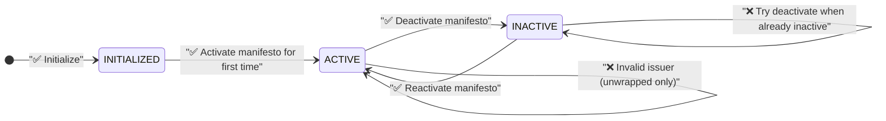

# Manifesto State Machine

This state machine implements a simple manifesto agreement that supports controller-based activation and deactivation. The manifesto allows a designated controller to enable or disable signature collection dynamically.

## State Machine Overview



## Key Features

1. **Controller-Based Access**: Only the designated controller can activate or deactivate the manifesto
2. **Dynamic State Management**: The manifesto can be toggled between active and inactive states multiple times
3. **Open Signature Collection**: When active, anyone can sign the manifesto without issuer validation
4. **Controlled Activation**: Signatures can only be collected when the manifesto is in ACTIVE state
5. **Simple Workflow**: Unlike complex agreement flows, this focuses on basic on/off functionality with signature collection

## Test Scenarios

### 1. Manifesto Signature Collection (Main Happy Path)

This demonstrates the primary use case: collecting signatures from multiple parties when the manifesto is active.



Happy Path Steps:

1. **Initialization**:
   - Manifesto is created and starts in `INITIALIZED` state
2. **Controller Activation**:
   - Controller activates the manifesto (`INITIALIZED → ACTIVE`)
   - Manifesto is now ready to accept signatures
3. **Alice Signs**:
   - Alice submits her signature (`ACTIVE → ACTIVE`)
   - State remains `ACTIVE` to continue collecting signatures
4. **Bob Signs**:
   - Bob submits his signature (`ACTIVE → ACTIVE`)
   - State remains `ACTIVE` for additional signatures
5. **Continue Collection**:
   - More parties can sign while manifesto remains `ACTIVE`
   - Each signature keeps the state as `ACTIVE`
6. **Controller Deactivation** (Optional):
   - Controller can deactivate when signature collection is complete (`ACTIVE → INACTIVE`)
   - No more signatures can be collected in `INACTIVE` state

### 2. Signature Collection Flow

This demonstrates the main use case: collecting signatures from multiple parties when the manifesto is active.



**Signature Details:**

- **Alice Johnson**: `0x4B20993Bc481177ec7E8f571ceCaE8A9e22C02db`
- **Bob Smith**: `0xBe32388C134a952cdBCc5673E93d46FfD8b85065`

**Key Points:**

- **Open Signing**: Anyone can sign when manifesto is `ACTIVE`
- **No Issuer Validation**: Signatures don't require specific issuer validation
- **State Persistence**: Manifesto remains `ACTIVE` to continue collecting signatures
- **Controller Control**: Only controller can start/stop signature collection

### 3. Security Validation Tests

These tests verify that only the designated controller can perform state transitions.



Test Cases:

1. **Valid Controller Operations**:
   - Controller address: `0x5B38Da6a701c568545dCfcB03FcB875f56beddC4`
   - All `activate`/`deactivate` inputs succeed when from valid controller
2. **Invalid Controller Rejection**:
   - Attempt from address: `0x1234567890123456789012345678901234567890`
   - Should fail with "Issuer mismatch" error
3. **Unknown Input Rejection**:
   - Invalid input IDs should be rejected
   - Should fail with "Unknown input" error

### 4. Complete Test Coverage

This shows all test scenarios including error cases and edge conditions:



Test Scenarios:

1. **Activate manifesto for first time** (`INITIALIZED → ACTIVE`)
2. **Deactivate manifesto** (`ACTIVE → INACTIVE`)
3. **Try to deactivate when already inactive** (should fail with "No valid transition")
4. **Reactivate manifesto** (`INACTIVE → ACTIVE`)
5. **Alice signs the manifesto** (`ACTIVE → ACTIVE`)
6. **Bob signs the manifesto** (`ACTIVE → ACTIVE`)
7. **Invalid input ID** (should fail with "Unknown input")
8. **Invalid issuer** (unwrapped only - should fail with "Issuer mismatch")

### 5. State Transition Rules

This documents the allowed and forbidden transitions in the state machine.

**Allowed Transitions:**

- `INITIALIZED → ACTIVE` (via `activate` input)
- `ACTIVE → INACTIVE` (via `deactivate` input)
- `INACTIVE → ACTIVE` (via `activate` input)
- `ACTIVE → ACTIVE` (via `signManifesto` input)

**Forbidden Transitions:**

- `INITIALIZED → INACTIVE` (must activate first)
- `INACTIVE → INACTIVE` (via `deactivate` - fails with "No valid transition")
- `INACTIVE → ACTIVE` (via `signManifesto` - signatures only accepted when active)

## Input Specifications

### Variables

#### Controller Variable

```json
{
  "controller": {
    "type": "address",
    "name": "Manifesto Controller",
    "description": "Ethereum address of the manifesto controller",
    "validation": {
      "required": true
    }
  }
}
```

#### Signature Variables

```json
{
  "signerName": {
    "type": "string",
    "name": "Signer Name",
    "description": "Name of the person signing the manifesto",
    "validation": {
      "required": true,
      "minLength": 1
    }
  },
  "signerAddress": {
    "type": "address",
    "name": "Signer Address", 
    "description": "Ethereum address of the signer",
    "validation": {
      "required": true
    }
  },
  "signature": {
    "type": "string",
    "name": "Digital Signature",
    "description": "Digital signature of the manifesto",
    "validation": {
      "required": true
    }
  }
}
```

#### Activate Input

```json
{
  "activate": {
    "type": "VerifiedCredentialEIP712",
    "schema": "verified-credential-eip712.schema.json",
    "displayName": "Reactivate",
    "description": "Reactivate the manifesto",
    "data": {
      "activation": "ACTIVATE"
    },
    "issuer": "${variables.controller.value}"
  }
}
```

#### Deactivate Input

```json
{
  "deactivate": {
    "type": "VerifiedCredentialEIP712",
    "schema": "verified-credential-eip712.schema.json",
    "displayName": "Deactivate",
    "description": "Deactivate the manifesto",
    "data": {
      "activation": "DEACTIVATE"
    },
    "issuer": "${variables.controller.value}"
  }
}
```

#### Sign Manifesto Input

```json
{
  "signManifesto": {
    "type": "VerifiedCredentialEIP712",
    "schema": "verified-credential-eip712.schema.json",
    "displayName": "Sign Manifesto",
    "description": "Sign the manifesto agreement",
    "data": {
      "signerName": "${variables.signerName}",
      "signerAddress": "${variables.signerAddress}",
      "signature": "${variables.signature}"
    }
  }
}
```

**Key Features:**

- **No Issuer Validation**: Unlike controller inputs, signatures don't specify an `issuer` field
- **Open Access**: Anyone can submit a signature when the manifesto is `ACTIVE`
- **Rich Data**: Captures signer name, address, and signature content
- **State Preservation**: Transitions from `ACTIVE → ACTIVE` to continue collecting signatures

## Test Input Format

The manifesto state machine supports both **wrapped** and **unwrapped** testing modes:

### Unwrapped Test Format (`validateVC = false`)

#### Controller Inputs (with Issuer Validation)

For controller inputs (`activate`/`deactivate`), inputs must use DID format for proper issuer validation:

```json
{
  "type": "VerifiedCredentialEIP712",
  "issuer": {
    "id": "did:pkh:eip155:1:0x5B38Da6a701c568545dCfcB03FcB875f56beddC4"
  },
  "credentialSubject": {
    "inputId": "activate",
    "type": "signedFields",
    "documentHash": "<agreement_hash>",
    "values": {
      "activation": "ACTIVATE"
    }
  }
}
```

#### Signature Inputs (no Issuer Validation)

For signature collection, the format is simpler since no issuer validation is required:

```json
{
  "inputId": "signManifesto",
  "type": "signedFields",
  "values": {
    "signerName": "Alice Johnson",
    "signerAddress": "0x4B20993Bc481177ec7E8f571ceCaE8A9e22C02db",
    "signature": "Alice's digital signature of the manifesto agreement"
  }
}
```

### Wrapped Test Format (`validateVC = true`)

For wrapped tests, inputs are full Verifiable Credentials with cryptographic signatures:

#### Wrapped Agreement Document

```json
{
  "issuer": {
    "id": "did:pkh:eip155:1:0x3fAC9dcd3830d147EB1361bDcf588b1E5cde4431"
  },
  "credentialSubject": {
    "id": "did:example:manifesto-1",
    "agreement": "<base64_encoded_manifesto_json>",
    "params": {
      "controller": "0x3fAC9dcd3830d147EB1361bDcf588b1E5cde4431"
    }
  },
  "type": ["VerifiableCredential", "AgreementCredential"],
  "proof": {
    "type": "EthereumEip712Signature2021",
    "proofValue": "0x...",
    "eip712": { /* EIP-712 signature data */ }
  }
}
```

#### Wrapped Input Examples

All inputs include full cryptographic proofs and are generated using Veramo:

- `input-activate.wrapped.json` - Controller activation
- `input-deactivate.wrapped.json` - Controller deactivation
- `input-alice-signature.wrapped.json` - Alice's signature
- `input-bob-signature.wrapped.json` - Bob's signature

### Test Coverage

**Unwrapped Tests (8 tests)**:

1. ✅ Activate manifesto for first time (`INITIALIZED → ACTIVE`)
2. ✅ Deactivate manifesto (`ACTIVE → INACTIVE`)
3. ✅ Try to deactivate when already inactive (failure case)
4. ✅ Reactivate manifesto (`INACTIVE → ACTIVE`)
5. ✅ Alice signs the manifesto (`ACTIVE → ACTIVE`)
6. ✅ Bob signs the manifesto (`ACTIVE → ACTIVE`)
7. ✅ Invalid input ID (failure case)
8. ✅ Invalid issuer - not controller (failure case)

**Wrapped Tests (8 tests)**:

1. ✅ Activate manifesto for first time (`INITIALIZED → ACTIVE`)
2. ✅ Deactivate manifesto (`ACTIVE → INACTIVE`)
3. ✅ Try to deactivate when already inactive (failure case)
4. ✅ Reactivate manifesto (`INACTIVE → ACTIVE`)
5. ✅ Alice signs the manifesto (`ACTIVE → ACTIVE`)
6. ✅ Bob signs the manifesto (`ACTIVE → ACTIVE`)
7. ✅ Invalid input ID (failure case)
8. ⏭️ Invalid issuer test (skipped - handled by crypto verification)

**Total: 16 test scenarios** covering both validation modes
*Plus initial state verification for each suite*

**Test Assertions: 36 total**

- Each successful test includes 2 assertions (success + state transition)
- Each failed test includes 3 assertions (failure + error message + state preservation)
- Unwrapped: 19 assertions across 8 test scenarios
- Wrapped: 17 assertions across 8 test scenarios

**Important Differences**:

- **Unwrapped**: Manual issuer validation using DID format
- **Wrapped**: Cryptographic verification handles issuer validation
- **Unwrapped**: Simplified JSON input format
- **Wrapped**: Full Verifiable Credential format with proofs

## Credential Creation

Wrapped inputs are generated using the Veramo framework with EIP-712 signatures:

```bash
cd tests/veramo-scripts
npx tsx ./src/manifesto/create-credential.ts
```

This script:

1. **Creates the wrapped manifesto agreement** with base64-encoded JSON
2. **Generates controller inputs** (`activate`, `deactivate`) signed by the controller
3. **Generates signature inputs** (`alice-signature`, `bob-signature`) signed by respective parties
4. **Applies cryptographic signatures** using EIP-712 standard
5. **Validates all credentials** before saving

## Implementation Notes

- **Dual Validation Modes**: Supports both unwrapped (manual validation) and wrapped (cryptographic validation)
- **Issuer Validation**:
  - **Unwrapped**: Manual validation using DID format extraction
  - **Wrapped**: Cryptographic signature verification
- **Variable Resolution**: Controller address resolved from initialization parameters
- **State Persistence**: Each transition recorded with metadata (issuer, timestamp, hash)
- **Error Handling**: Clear error messages for invalid inputs, transitions, and issuers
- **Security**:
  - **Controller Actions**: Restricted to designated controller address
  - **Signature Collection**: Open access when manifesto is active
  - **Cryptographic Integrity**: Full EIP-712 signature verification in wrapped mode

## Differences from Other State Machines

Unlike complex workflows (like grant-with-feedback), the manifesto state machine is designed for:

- **Simplicity**: Only three states with basic transitions
- **Dual Access Model**: Controller-based management for activation/deactivation + open signature collection
- **Signature Collection**: Primary use case is gathering signatures from multiple parties when active
- **Reusability**: Can be activated/deactivated multiple times unlike one-way agreement flows
- **Mixed Validation**: Strong issuer validation for controller actions, no validation for signatures
- **State Persistence**: Remains in ACTIVE state while collecting multiple signatures

# The Consensys Network State Manifesto

The modern nation-state is a legacy system incapable of navigating the complexities of our hyper-connected, technologically-transformed, post-globalized world. Institutions that once promised to serve humanity now concentrate power and wealth, betraying their foundational purpose.

To move forward, we must unlearn the paradigms of the past and reimagine how we coordinate, govern, and create. The rise of network states, rooted not in geography but in shared values and digital sovereignty, signals the dawn of a new societal substrate, a world where communities self-organize beyond borders, united by principles rather than proximity.

The Consensys Network State is a continuation of Ethereum’s founding vision: a decentralized, open, and permissionless system that empowers individuals and collectives to operate beyond the nation-state. We are not an island, we are part of a broader constellation of value-driven communities aligned around autonomy, agency, and shared purpose.

Citizens of the Consensys Network State are not defined by passports, borders, or bloodlines. We are linked by a culture of interconnectedness, plurality, and digital self-sovereignty. We recognize all people, human and non-human, as deserving of dignity, privacy, and the right to self-determination.

We reject the arbitrary divisions of legacy systems. In their place, we cultivate a future where people and communities define their own identities, govern their own affairs, and co-create institutions that reflect their values. Local sovereignty becomes a strength, not a boundary. Local communities support each other across distances and divisions, sharing knowledge, skills, and technology.

Across the network state, founders access support, mentorship, guidance and capital, mutual credit systems link informal traders in Manila with cooperatives in São Paulo. Decentralized lending protocols fund agricultural co-ops in Nairobi. Housing cooperatives in Athens coordinate with mutual aid groups in Oakland. Community crowdfunding supports regenerative manufacturing hubs in Kerala. These are not thought experiments, they are living examples of coordination without borders, trust built through code, and solidarity sustained through shared purpose.

We transcend the constraints of traditional governance by operating on a higher layer of coordination: a meta-system designed to serve its citizens transparently, efficiently, and equitably, wherever they are in the world. The network state operates on a layer above nation-states, and will steadily attract increasing amounts of the world’s capital, talent, innovation and economic activity. Ours is not a fixed territory, but a fluid, interwoven network of jurisdictions bound by consent and cooperation.

We live in the intersectioninterstice between a fading past and an emerging future. The Consensys Network State is built to navigate this liminal space, bridging legacy institutions with network-native systems. This is not an escape or exit. It is an evolution. This is not about rejecting society, it’s about supporting people through a period of deep transformation, toward new forms of coordination that honor complexity, diversity, and interdependence.
This is Web3’s next frontier: a global mesh of self-sovereign collectives, where coordination happens without coercion and communities thrive beyond centralized control.

The Consensys Network State is a platform for experimentation, advancing the tools, protocols, and practices that nurture resilience and autonomy through radical decentralization. We pair this decentralization with cohesion, anchored in shared values, mutual agreements, and trustless collaboration.

We live the ethos we champion: consent, transparency, and human connection. We are not waiting for the future to arrive. We are building it. Together.
We call on builders, dreamers, thinkers, and doers. Not as users, but as co-creators of a new societal substrate. This is more than a manifesto, it is a declaration of interdependence.

Join the movement.
