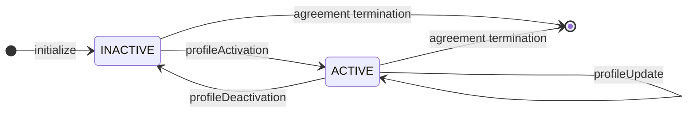
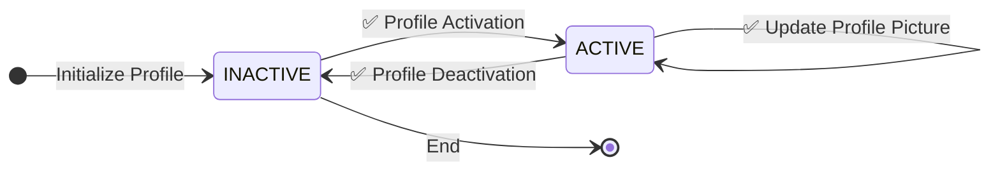
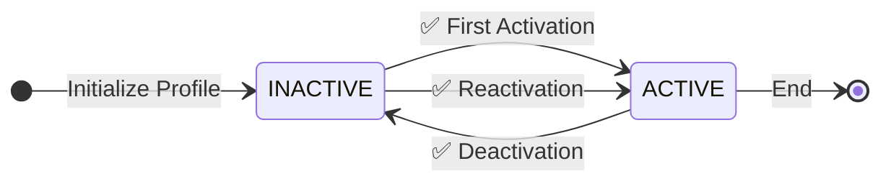
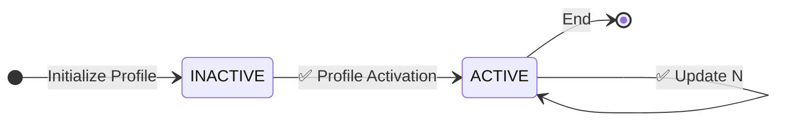

# Profile Agreement State Machine

This state machine implements a profile agreement that allows users to manage their profile lifecycle, including activation, field updates, and deactivation.

## State Machine Overview

## Key Features

1. **Simple State Management**: The profile starts in an INACTIVE state and can be activated by the user.
2. **Profile Updates**: Once active, users can update their profile information (nickname, bio, profile picture) without changing the state.
3. **Reversible Deactivation**: Users can deactivate their profile, returning to the INACTIVE state, and can reactivate it later.
4. **Self-Loop Updates**: Profile updates in the ACTIVE state maintain the same state, allowing for continuous modifications.

## States

### INACTIVE
- **Description**: Profile is inactive and not visible to other users
- **Available Actions**: User can activate the profile
- **Characteristics**: 
  - Profile data is preserved but not publicly accessible
  - User can reactivate at any time

### ACTIVE  
- **Description**: Profile is active and visible to other users
- **Available Actions**: User can update profile fields or deactivate the profile
- **Characteristics**:
  - Profile is publicly visible and functional
  - All profile fields can be modified
  - User can interact with the platform normally

## Inputs and Transitions

### 1. Profile Activation (`profileActivation`)
- **From**: INACTIVE
- **To**: ACTIVE
- **Description**: User activates their profile, making it visible and functional
- **Required Data**:
  - User signature
  - Profile creation timestamp
  - Active status flag

### 2. Profile Update (`profileUpdate`)
- **From**: ACTIVE
- **To**: ACTIVE (self-loop)
- **Description**: User updates profile information while maintaining active status
- **Updatable Fields**:
  - Nickname (display name, max 50 characters)
  - Bio (description, max 500 characters)
  - Profile picture (URL or hash)

### 3. Profile Deactivation (`profileDeactivation`)
- **From**: ACTIVE
- **To**: INACTIVE
- **Description**: User deactivates their profile, hiding it from public view
- **Optional Data**:
  - Deactivation reason (max 200 characters)

## Test Scenarios

### 1. Basic Profile Lifecycle
This test demonstrates the complete profile lifecycle from creation to deactivation.

Test Steps:
1. Profile Initialization: Profile starts in INACTIVE state
2. Profile Activation: User activates profile with signature
3. Profile Updates: User updates various profile fields multiple times
4. Profile Deactivation: User deactivates profile with optional reason

### 2. Reactivation Flow
This test verifies that profiles can be reactivated after deactivation.

Test Steps:
1. Profile is activated for the first time
2. Profile is deactivated
3. Profile is reactivated, restoring functionality

### 3. Continuous Updates
This test verifies that profile updates can be performed continuously while active.

Test Steps:
1. Profile is activated
2. Multiple profile updates are performed in sequence
3. Each update maintains the ACTIVE state
4. All updates are successfully applied

## Implementation Notes

- The state machine supports both initialization and ongoing management of user profiles
- Profile data is preserved during deactivation - only visibility is affected
- All profile updates require validation according to field constraints (length limits, etc.)
- The agreement can be terminated from either INACTIVE or ACTIVE states
- Users maintain full control over their profile lifecycle and data

## Data Validation

- **Nickname**: Optional, maximum 50 characters
- **Bio**: Optional, maximum 500 characters  
- **Profile Picture**: Optional, URL or content hash
- **Deactivation Reason**: Optional, maximum 200 characters
- **User Signature**: Required for activation
- **Ethereum Address**: Required for all operations

## Input File Reference

The following input files are provided for testing the state machine:

- **`input-profile-activation.json`**: Initial profile activation
- **`input-profile-reactivation.json`**: Profile reactivation after deactivation
- **`input-profile-update.json`**: Complete profile update with all fields
- **`input-profile-update-2.json`**: Alternative profile update with different values
- **`input-profile-update-partial.json`**: Partial update (nickname only)
- **`input-profile-deactivation.json`**: Profile deactivation with reason 